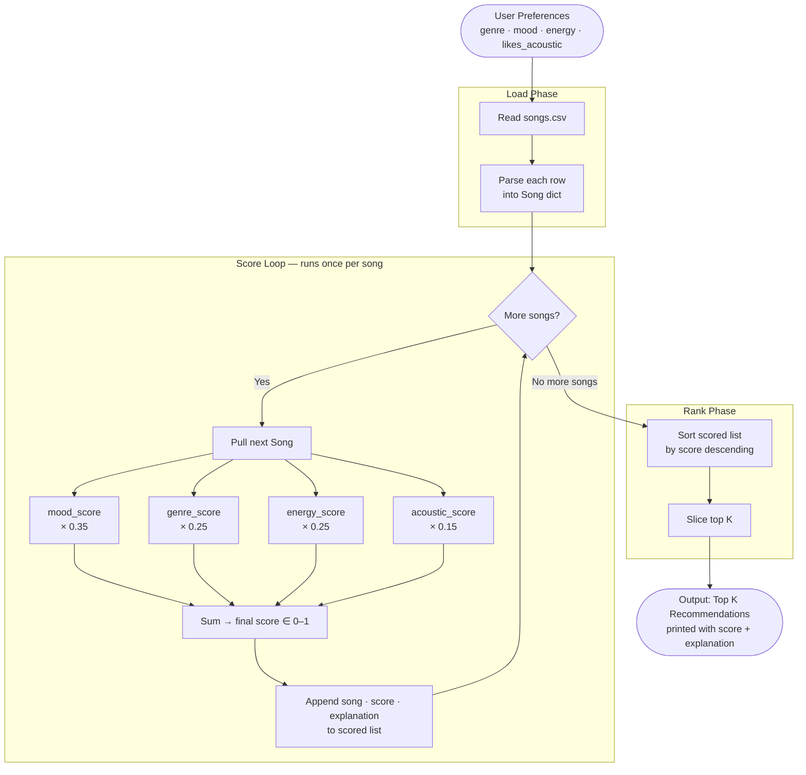

# 🎵 Music Recommender Simulation

## Weekly TF Task 6

The core concept students needed to understand is the transformation of data into predictions, distinguishing between input features, user preferences, and ranking algorithms. Students are most likely to struggle in finding some good weights for their model, each change can affect the outcome of the predictions. The AI was helpful in implementing the functions based on the requirements. However, I had to correct in to the value returned from the score_songs function so that it could have the explanation. One way I would guide a student without giving the answer is to encourage them to keep the model testing close to their preferences and what they expect while troubleshooting, it’s way harder if you don’t even know what is supposed to be.


## Project Summary

In this project you will build and explain a small music recommender system.

Your goal is to:

- Represent songs and a user "taste profile" as data
- Design a scoring rule that turns that data into recommendations
- Evaluate what your system gets right and wrong
- Reflect on how this mirrors real world AI recommenders

Replace this paragraph with your own summary of what your version does.

---

## How The System Works

Real-work recommendations work by what "people like you" enjoy (collaborative filtering) and what the content itself "is" like (content‑based filtering).


This recommender uses **content-based filtering** — it scores every song against a single user profile and returns the top K matches. There is no "people like you" component; the system only looks at the song's own attributes.

### Song Features

Each `Song` in `data/songs.csv` carries ten attributes:

| Attribute | Type | Role |
| --- | --- | --- |
| `genre` | categorical | matched against user's favorite genre |
| `mood` | categorical | matched against user's current mood |
| `energy` | float 0–1 | compared to user's target energy level |
| `acousticness` | float 0–1 | matched to user's acoustic preference |
| `tempo_bpm`, `valence`, `danceability` | float | available for future scoring extensions |

### User Profile

A `UserProfile` stores four fields:

- `favorite_genre` — the genre the user prefers long-term
- `favorite_mood` — the mood that fits their current context
- `target_energy` — how high-energy they want the music right now
- `likes_acoustic` — boolean preference for acoustic vs. produced sound

### Algorithm Recipe

For every song in the catalog, the recommender computes a score using a weighted sum:

```text
score = (0.35 × mood_score)
      + (0.25 × genre_score)
      + (0.25 × energy_score)
      + (0.15 × acoustic_score)
```

Each sub-score is calculated as follows:

| Sub-score | Formula |
| --- | --- |
| `mood_score` | `1.0` if `song.mood == user.favorite_mood`, else `0.0` |
| `genre_score` | `1.0` if `song.genre == user.favorite_genre`, else `0.0` |
| `energy_score` | `1.0 - abs(song.energy - user.target_energy)` |
| `acoustic_score` | `song.acousticness` if `likes_acoustic` else `1.0 - song.acousticness` |

After all songs are scored, the list is sorted by score descending and the top `k` results are returned with a plain-language explanation of why each song matched.

**Weight rationale:** Mood carries the highest weight (0.35) because it reflects *current context* — why someone is listening right now. Genre (0.25) is a strong but more stable long-term preference. Energy (0.25) is a precise numeric signal that bridges the two categorical fields. Acousticness (0.15) acts as a tiebreaker for otherwise close matches.

### Data Flow Diagram



### Expected Biases

| Bias | Why it happens | Effect |
| --- | --- | --- |
| **Mood lock-in** | Mood is binary (exact match or zero). No partial credit for similar moods. | Songs with a close-but-not-identical mood (e.g. `relaxed` vs. `chill`) are heavily penalized regardless of how well everything else fits. |
| **Genre favoritism** | Genre is also binary, awarding nothing to adjacent genres. | A user who likes `pop` will never surface `indie pop` or `synthwave` unless genre scoring is extended with a similarity map. |
| **Popularity-blind** | The catalog is small and hand-curated, not drawn from real listening data. | Genres and moods that happen to have more songs in the CSV will statistically appear more often in top-K results. |
| **Static profile** | The `UserProfile` does not change between sessions. | The system cannot adapt if a user's mood shifts mid-listen or if they grow tired of a genre over time. |
| **Energy-skew for acoustic users** | `acoustic_score` rewards high acousticness regardless of energy level. | A user who `likes_acoustic = True` and `target_energy = 0.9` could receive quiet, slow songs that feel tonally wrong even at a high score. |

---


## Preview 

### Phase 3 Screenshot


### Phase 4 Screenshot


## Getting Started

### Setup

1. Create a virtual environment (optional but recommended):

   ```bash
   python -m venv .venv
   source .venv/bin/activate      # Mac or Linux
   .venv\Scripts\activate         # Windows

2. Install dependencies

```bash
pip install -r requirements.txt
```

3. Run the app:

```bash
python -m src.main
```

### Running Tests

Run the starter tests with:

```bash
pytest
```

You can add more tests in `tests/test_recommender.py`.

---

## Experiments You Tried

Use this section to document the experiments you ran. For example:

- What happened when you changed the weight on genre from 2.0 to 0.5
- What happened when you added tempo or valence to the score
- How did your system behave for different types of users

---

## Limitations and Risks

Summarize some limitations of your recommender.

Examples:

- It only works on a tiny catalog
- It does not understand lyrics or language
- It might over favor one genre or mood

You will go deeper on this in your model card.

---

## Reflection

Read and complete `model_card.md`:

[**Model Card**](model_card.md)

Write 1 to 2 paragraphs here about what you learned:

- about how recommenders turn data into predictions
- about where bias or unfairness could show up in systems like this


---

## 7. `model_card_template.md`

Combines reflection and model card framing from the Module 3 guidance. :contentReference[oaicite:2]{index=2}  

```markdown
# 🎧 Model Card - Music Recommender Simulation

## 1. Model Name

Give your recommender a name, for example:

> VibeFinder 1.0

---

## 2. Intended Use

- What is this system trying to do
- Who is it for

Example:

> This model suggests 3 to 5 songs from a small catalog based on a user's preferred genre, mood, and energy level. It is for classroom exploration only, not for real users.

---

## 3. How It Works (Short Explanation)

Describe your scoring logic in plain language.

- What features of each song does it consider
- What information about the user does it use
- How does it turn those into a number

Try to avoid code in this section, treat it like an explanation to a non programmer.

---

## 4. Data

Describe your dataset.

- How many songs are in `data/songs.csv`
- Did you add or remove any songs
- What kinds of genres or moods are represented
- Whose taste does this data mostly reflect

---

## 5. Strengths

Where does your recommender work well

You can think about:
- Situations where the top results "felt right"
- Particular user profiles it served well
- Simplicity or transparency benefits

---

## 6. Limitations and Bias

Where does your recommender struggle

Some prompts:
- Does it ignore some genres or moods
- Does it treat all users as if they have the same taste shape
- Is it biased toward high energy or one genre by default
- How could this be unfair if used in a real product

---

## 7. Evaluation

How did you check your system

Examples:
- You tried multiple user profiles and wrote down whether the results matched your expectations
- You compared your simulation to what a real app like Spotify or YouTube tends to recommend
- You wrote tests for your scoring logic

You do not need a numeric metric, but if you used one, explain what it measures.

---

## 8. Future Work

If you had more time, how would you improve this recommender

Examples:

- Add support for multiple users and "group vibe" recommendations
- Balance diversity of songs instead of always picking the closest match
- Use more features, like tempo ranges or lyric themes

---

## 9. Personal Reflection

A few sentences about what you learned:

- What surprised you about how your system behaved
- How did building this change how you think about real music recommenders
- Where do you think human judgment still matters, even if the model seems "smart"

