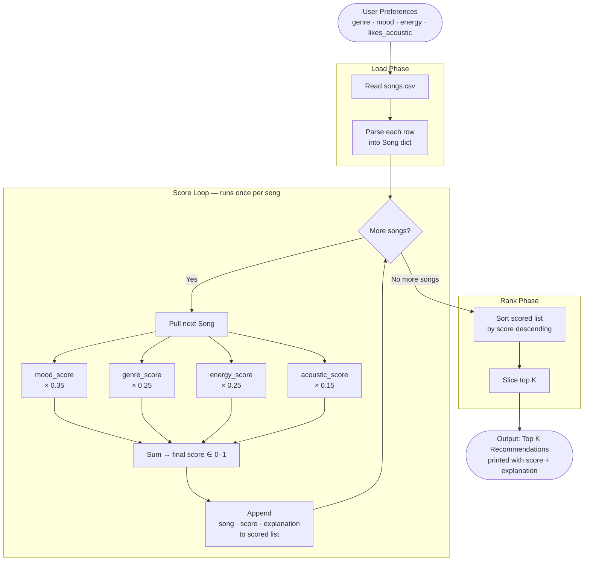

```mermaid
flowchart TD
    A([User Preferences\ngenre · mood · energy · likes_acoustic]) --> B

    subgraph LOAD ["Load Phase"]
        B[Read songs.csv] --> C[Parse each row\ninto Song dict]
    end

    C --> D

    subgraph LOOP ["Score Loop — runs once per song"]
        D{More songs?} -->|Yes| E[Pull next Song]
        E --> F1[mood_score\n× 0.35]
        E --> F2[genre_score\n× 0.25]
        E --> F3[energy_score\n× 0.25]
        E --> F4[acoustic_score\n× 0.15]
        F1 & F2 & F3 & F4 --> G[Sum → final score ∈ 0–1]
        G --> H[Append\nsong · score · explanation\nto scored list]
        H --> D
    end

    D -->|No more songs| I

    subgraph RANK ["Rank Phase"]
        I[Sort scored list\nby score descending] --> J[Slice top K]
    end

    J --> K([Output: Top K Recommendations\nprinted with score + explanation])
```
